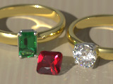

# GemCuts

Gem cuts and settings. The initial version defines the emerald and round brilliant cuts along with rings and prong settings. More cuts will be added in future versions.

This project is a module from the Persistence of Vision Raytracer (POV-Ray) Object Collection.
